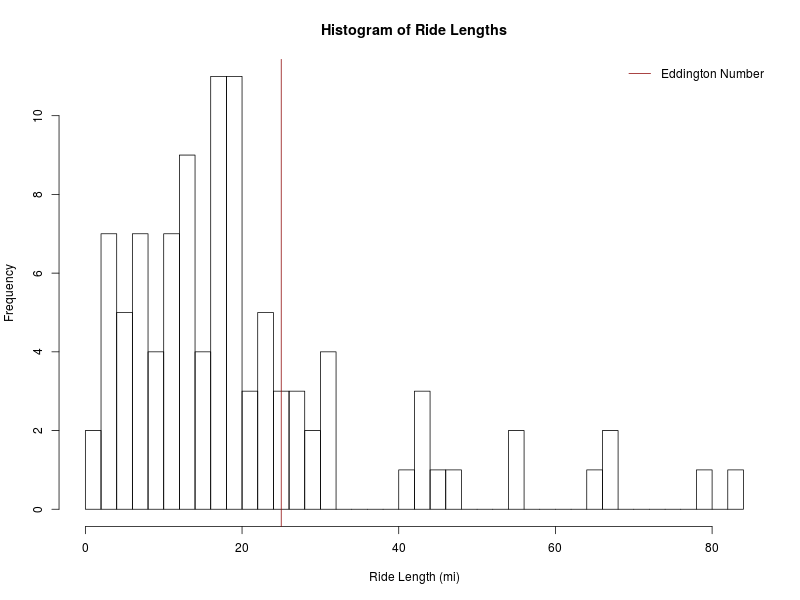
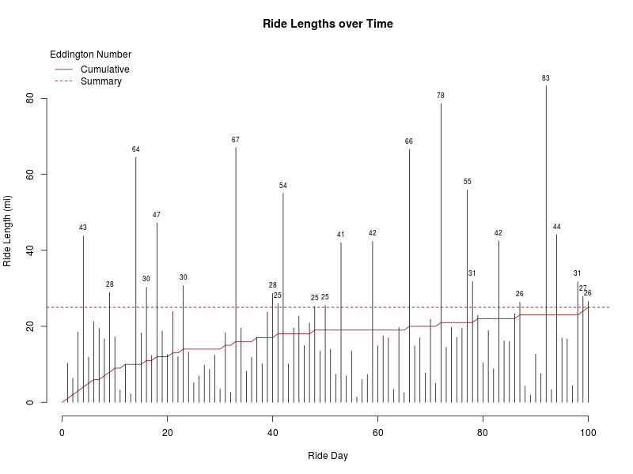

Mock Data for Testing
=====================

This folder contains three files:

| File Name       | Description                                                 |
|:----------------|:------------------------------------------------------------|
| ride-gen.r      | Script for creating simulated ride length data             |
| rides.dat       | Simulated data (in miles) of 100 rides -- E = 25            |
| E\_expected.dat | The cumulative Eddington numbers of the rides in *rides.dat*|

## Summary Statistics

|             |   N|   |  Mean|    SD|   |  Min|   Q1| Median|    Q3|   Max|
|:------------|---:|:--|-----:|-----:|:--|----:|----:|------:|-----:|-----:|
|Ride Length  | 100|   | 20.33| 16.64|   | 1.41|  9.9|  16.98| 24.58| 83.27|
|Cumulative E | 100|   | 16.94|  5.50|   | 1.00| 14.0|  19.00| 21.00| 25.00|

## Histogram of Ride Lengths

This plot provides a histogram of the ride lengths. Note the summary Eddington
number is in dark red.

## Cumulative Eddington Number

This plot provides a needle plot of ride lengths over time. Again, note the 
summary Eddington number is in dark red.

